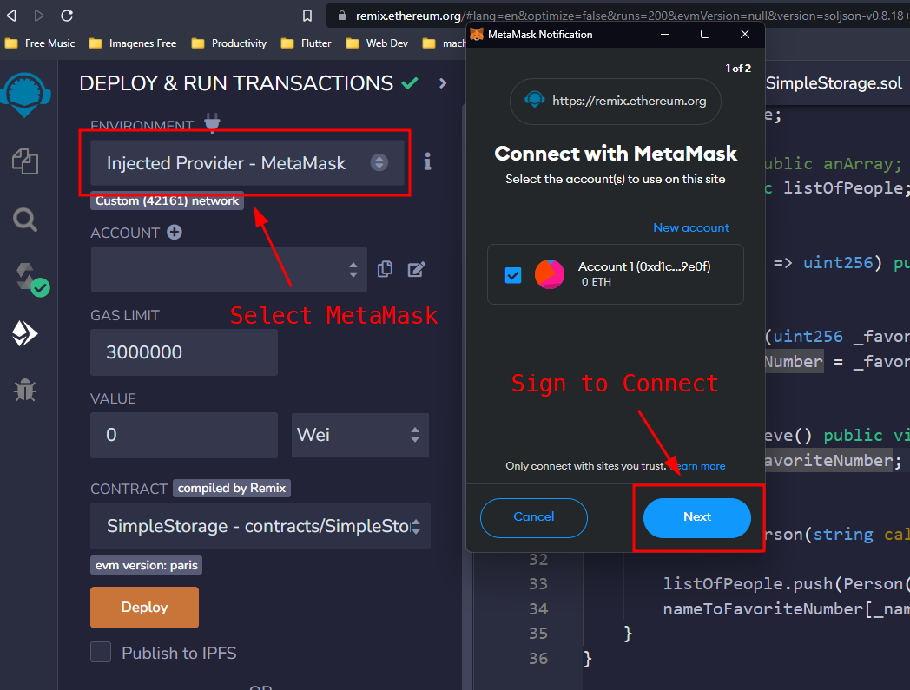
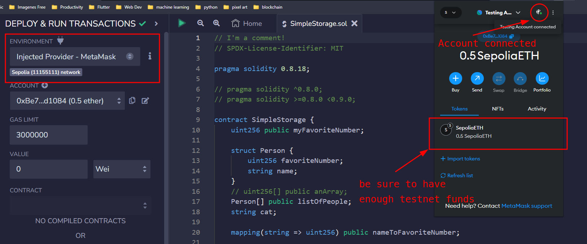
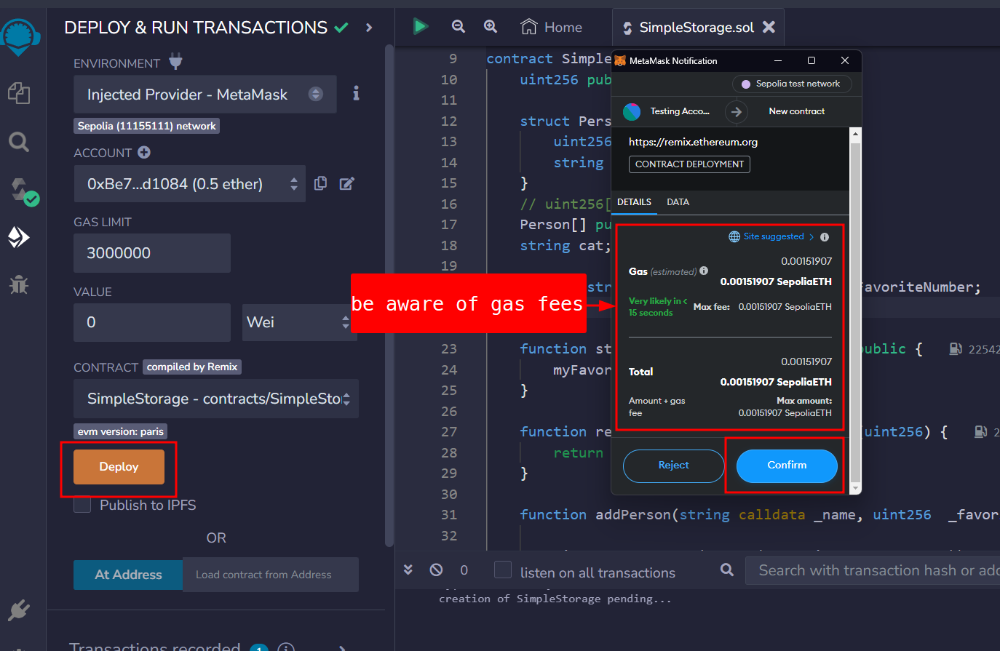
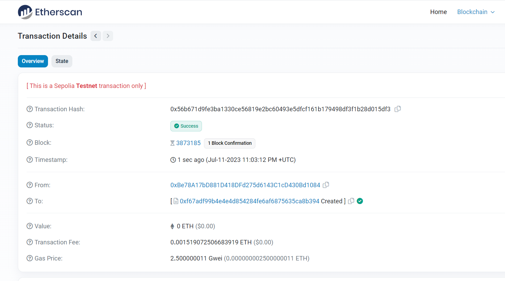
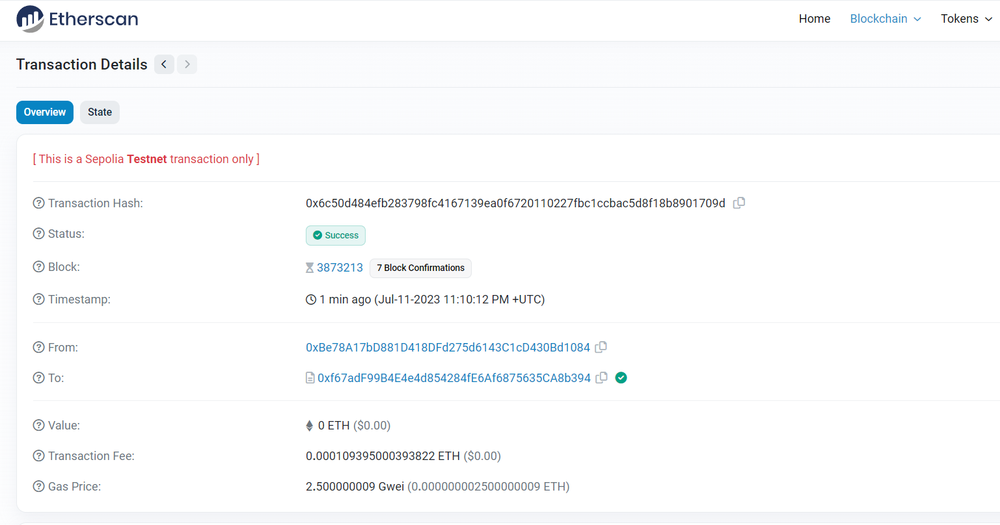
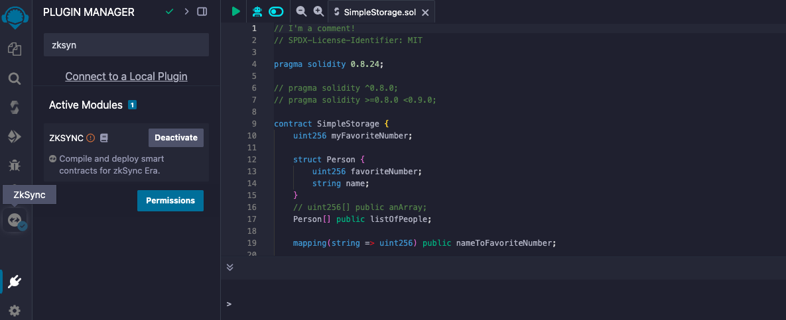
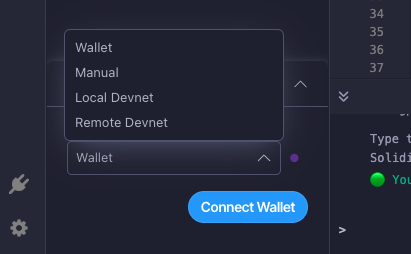
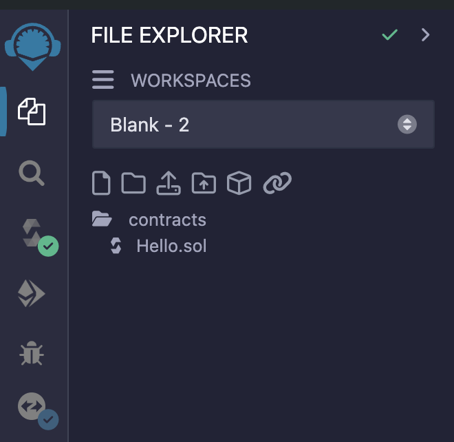
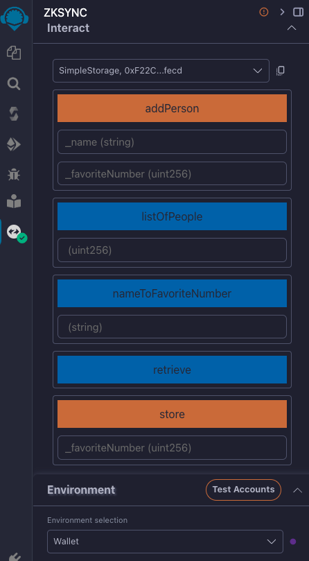

# SimpleStorage

## Remix IDE

Open this link [to get started](https://remix.ethereum.org/)

This is an IDE (Integrated Development Environment), a powerful tool used to build and develop smart contracts in Solidity. It helps to easily visualize and interact with our smart contracts. It contains a file explorer that hosts all the files, a Solidity compiler and a tab where you can deploy your contracts.

1. 🧹 Remove all the existing files and folders by right-clicking on them (optional).
2. ✨ Create a new file, e.g., `SimpleStorage.sol`. The `.sol` extension tells the compiler that this is a Solidity file.

### Compiler directive

The `pragma` directive specifies the _version_ of the Solidity compiler that you want to use to build your source file. When the compiler encounters this line, it will check its version against the one you specified here. If the compiler version is different, Remix will automatically adjust accordingly to your specifications.

You can specify the compiler version(s) in the following ways:

1 use exactly **one** version

```solidity
pragma solidity 0.8.19; // use only version 0.8.19
```

2 use versions that fall **within** a lower and upper range

```solidity
// use versions between 0.8.19 and 0.9.0 (excluded)
pragma solidity ^0.8.19;
pragma solidity >=0.8.19 <0.9.0;
```

> 🗒️ **NOTE** <br />
> Remember to write comments in your code for you to refer to later on.

### SPDX License Identifier

It's a good practice (even not mandatory) to start your smart contract with an SPDX License Identifier. It helps in making licensing and sharing code easier from a legal perspective.

```solidity
// SPDX-License-Identifier: MIT
pragma solidity ^0.8.19;
```

The MIT license is recognized as one of the most permissive, granting anyone the freedom to use the following code and essentially use it as they see fit.

### Writing the Smart Contract

You can start writing your contract using the keyword `contract` followed by a name, e.g., `SimpleStorage`. All the code inside the curly brackets will be considered part of this contract.

If you are familiar with Object Oriented Programming languages, you can think of a _contract_ as a concept similar to a _class_.

```solidity
// SPDX-License-Identifier: MIT
pragma solidity ^0.8.19;

contract SimpleStorage {
    //this is where we'll place the content of the contract
}
```

### Compiling

1. In Remix IDE, select the Solidity Compiler.
2. Choose the version of the compiler that matches the version specified in your Solidity file.
3. Hit the `Compile` button.

Compiling your code means taking **human-readable code** and transforming it into **computer-readable code** or **bytecode**.

If you see a green checkmark, it means your compilation was successful. If there is any error, Remix will point out where the error is, and you can debug it accordingly.

EVM => Ethereum Virtual Machine

## Solidity Types

Solidity supports various _elementary_ types that can be combined to create more _complex_ ones. You can read more about them in the [Solidity documentation](https://docs.soliditylang.org/en/v0.8.20/types.html#types).

🕵️‍♂️ For now, let's focus on the most commonly used

-   Boolean (bool): true or false
-   Unsigned Integer (uint): unsigned whole number (positive)
-   Integer (int): signed whole number (positive and negative)
-   Address (address): 20 bytes value. An example of an address can be found within your MetaMask account.
-   Bytes (bytes): low-level raw byte data

### Variables definition

Variables are just placeholders for **values**. A value can be one **data type** described in the list above. For instance, we could create a Boolean variable named `hasFavoriteNumber`, which would represent whether someone has a favourite number or not (constant `true` or `false`).

```solidity
bool hasFavoriteNumber = true; // The variable `hasFavoriteNumber` represents the value `true`
```

It's possible to specify the number of **bits** used for `uint` and `int`. For example, uint256 specifies that the variable has 256 bits. uint is a shorthand for uint256.

> 🗒️ **NOTE** <br />
> It's always advisable to be **explicit** when specifying the length of the data type.

The _semicolon_ at the end of each line signifies that a statement is completed.

```solidity
// SPDX-License-Identifier: MIT
pragma solidity 0.8.19;

contract SimpleStorage {
    // Basic types
    bool hasFavoriteNumber = true;
    uint256 favoriteNumber = 88;
    string favoriteNumberInText = "eighty-eight";
    int256 favoriteInt = -88;
    address myAddress = 0xaB1B7206AA6840C795aB7A6AE8b15417b7E63a8d;
    bytes32 favoriteBytes32 = "cat";
}
```

### Bytes and strings

Bytes are a _collection of characters_ written in hexadecimal representation.

```solidity
bytes1 minBytes = "I am a fixed size byte array of 1 byte";
bytes32 maxBytes = "I am a fixed size byte array of 32 bytes";
bytes dynamicBytes = "I am a dynamic array, so you can manipulate my size";
```

Bytes can be allocated in size (up to `bytes32`). However, bytes and bytes32 represent distinct data types.

**Strings** are internally represented as _dynamic byte arrays_ (`bytes` type) and designed specifically for working with text. For this reason, a string can easily be converted into bytes.

[Bits and Bytes overview](https://www.youtube.com/watch?v=Dnd28lQHquU)

### The contract logic

📋 Let's explore a scenario where there is a task involving the storage of a favourite number. For this purpose, we can start storing the variable `favoriteNumber` of type `uint`:

```solidity
uint256 favoriteNumber;
```

> 👀❗**IMPORTANT** <br />
> Every variable in Solidity comes with a _default value_. Uninitialized uint256 for example, defaults to `0` (zero) and an uninitialized boolean defaults to `false`.

## Functions

In the previous lesson, we added a storage variable `favoriteNumber` within our first smart contract and explored different solidity types. In this lesson, you'll discover how to update and retrieve a storage variable, while also learning about functions, visibility, deployment, transactions, gas usage and variable scope.

### Building the **store** function

📋 To store the `favoriteNumber` variable, we need to implement a new **function**. In Solidity, functions - or methods, are portions of code designed to execute specific tasks within the overall codebase. We'll call this new function `store`, and it will be responsible for updating the `favoriteNumber` variable.

```solidity
contract SimpleStorage {

    uint256 favoriteNumber; // a function will update this variable

    // the function will be written here
}
```

Functions are identified by the keyword `function`, followed by a custom **name** (e.g. "store") and any additional **parameters** enclosed in rounded parentheses `()`.
These parameters represent the values sent to our function. In this case, we inform the `store` function that we want to update `favoriteNumber` with some other value `_favoriteNumber`:

```solidity
contract SimpleStorage {

    uint256 favoriteNumber; // storage variable: it's stored in a section of the blockchain called "Storage"

    function store(uint256 _favoriteNumber) public {
        // the variable favorite number is updated with the value that is contained into the parameter `_favoriteNumber`
        favoriteNumber = _favoriteNumber;
    }
}
```

The content of the function is placed within the curly brackets `{}`.
The prefix `_` before `_favoriteNumber` is used to emphasise that the _**local**_ variable `_favoriteNumber` is a **different** variable from the _**state**_ variable `favoriteNumber`. This helps prevent potential confusion when dealing with different variables with similar names in complex codebases.

### Deploying the smart contract

You can test out this function in the Remix VM environment.
At this stage, you can compile your code by navigating to the compile tab and hitting Compile. After compiling, navigate to the tab **Deploy and Run Transactions** to test your function.

The **Deploy and Run Transactions** tab holds a variety of parameters that are used during the deployment process.
You'll be assigned an _account_ with some ETH to deploy your smart contract.


In this environment, your contract is assigned a unique address. You can re-access your deployed contract by expanding the **Deployed Contracts** interface and simultaneously opening the terminal, which shows log data of all contract deployments and transactions.


If we open the Remix terminal we can see that deploying the contract has just sent a simulated transaction on the Remix environment. You can check out its details such as status, hash, from, to and gas.

> 👀❗**IMPORTANT** <br />
> The process of sending a transaction is the **same** for deploying a contract and for sending Ethers. The only difference is that the machine-readable code of the deployed contract is placed inside the _data_ field of the deployment transaction.

### Transactions creation

Let's send a transaction to the `store` function to change the value of the variable `favoriteNumber`: you can insert a number and press the `store` button in Remix. A transaction is initiated and after some time, its status will change from pending to complete.

💸 From the accounts section, it becomes visible that ETH is being consumed every time a transaction is submitted. When the state of the blockchain is modified (e.g. deploying a contract, sending ETH, ...), is done by sending a transaction that consumes **gas**. Executing the `store` function is more expensive than just transferring ETH between accounts, with the rising gas expenses primarily associated (though not exclusively) with the code length.

#### Verifying the stored value

This contract is missing a way to check if the number has been updated: now we can store a value but we cannot be sure if the transaction **actually** changed the variable value.

The default visibility of the `favoriteNumber` variable is **internal**, preventing external contracts and users from viewing it.

> 🗒️ **NOTE**:<br />
> Appending the `public` keyword next to a variable will automatically change its visibility and it will generate a **getter function** (a function that gets the variable's value when called).

```solidity
uint256 public favoriteNumber;
```

After completing compilation and deployment, a button labelled `favoriteNumber` will become visible. When pressed, it should return the most recent stored value of the variable `favoriteNumber`.


#### Visibility

In Solidity, functions and variables can have one of these four [visibility](https://docs.soliditylang.org/en/latest/contracts.html#visibility-and-getters) specifiers:

-   🌎 **`public`**: accessible from both inside the contract and from external contracts
-   🏠 **`private`**: accessible only within the _current contract_. It does not hide a value but only restricts its access.
-   🌲 **`external`**: used only for _functions_. Visible only from _outside_ the contract.
-   🏠🏠 **`internal`**: accessible by the current contract and any contracts _derived_ from it.

If a visibility specifier is not given, it defaults to `internal`.

#### Function modifiers

1. view => Disallows modification or access of state, just going to read the state of a contract => cost no gas
2. pure => Disallows modification of state, also disallow you to read from the blockchain state => cost no gas
3. payable
4. constant
5. immutable
6. anonymous
7. indexed
8. virtual
9. override

-   view and pure modifiers do not cost any gas because we are just reading from the blockchain. we only spend gas if we modify the blockchain state.

-   they will cost a gas only when if ad gas calling function calls a view or pure functions.

```js
    // view
    function retrieve() public view returns(uint256) {
        return favouriteNumber;
    }

    // pure
    function add() public pure returns(uint256) {
        return (1 + 1);
    }
```

to learn about function modifiers you can red the doc [here](https://docs.soliditylang.org/en/v0.8.26/cheatsheet.html#modifiers)

#### Pure and View keywords

The terms `view` and `pure` are used when a function reads values from the blockchain without altering its state. Such functions will not initiate transactions but rather make calls, represented as blue buttons in the Remix interface. A `pure` function will prohibit any reading from the state or storage.

```solidity
function retrieve() public view returns(uint256) {
    return favoriteNumber;
}
```

```solidity
function retrieve() public pure returns(uint256) {
    return 7;
}
```


The keyword `returns` specifies the type(s) of value a function will return.

> 🚧 **WARNING** <br />
> While calling `view` or `pure` functions doesn’t typically require gas, they do require it when called by another function that modifies the state or storage through a transaction (e.g. calling the function `retrieve` inside the function `storage`). This cost is called **execution cost** and it will add up to the transaction cost.

### The scope of a variable

The scope of a variable refers to the **context** within which it is defined and accessible. This context is usually determined by the block of code, typically enclosed in curly braces `{}`, where the variable is declared. To access the same variable across different functions, it should be declared inside the scope of the main contract.

```solidity
function store(uint256 _favoriteNumber) public {
    favoriteNumber = _favoriteNumber;
    uint256 testVar = 5;
}

function something() public {
   testVar = 6; // will raise a compilation error
   favoriteNumber = 7; // this can be accessed because it's in the main contract scope
}
```

Up to this point, the `SimpleStorage` contract allows for storing, updating, and viewing a single favorite number. In this lesson, we'll enhance the code to store multiple numbers, enabling more than one person to store their values. We'll learn how to create a list of favorite numbers using **arrays**, and we'll explore the **`struct`** keyword for creating new types in Solidity.

## Arrays and struct

First we need to replace the `uint256 favoriteNumber` with a list of `uint256` numbers:

```solidity
uint256[] list_of_favorite_numbers;
```

The brackets indicate that we have a list of `uint256`, an array of numbers. If we want to initialize this array we can do so by specifying its content:

```solidity
uint256[] list_of_favorite_numbers = [0, 78, 90];
```

> 🗒️ **NOTE** <br />
> Arrays are zero-indexed: the first element is at position zero (has index 0), the second element is at position one (has index 1), and so on.

The issue with this data structure is that we cannot link the owner with its favorite value. One solution is to establish a **new type** using the `struct` keyword, named `Person`, which is made of two _attributes_: a favorite number and a name.

```solidity
struct Person {
    uint256 my_favorite_number;
    string name;
}
```

> 🚧 **WARNING** <br />
> Rename the variables `favorite_number` to avoid name clashes

From this struct, we can instantiate a variable `my_friend` that has the type `Person`, with a favorite number of seven and the name 'Pat'. We can retrieve these details using the getter function that was generated by the `public` keyword.

```solidity
Person public my_friend = Person(7, 'Pat');
/* equals to
Person public my_friend = Person({
    favorite_number:7,
    name:'Pat'});
*/
```

### Array of struct

Creating individual variables that represent several people might become a tedious task, due to the repetitive steps of the process. Instead of manually instantiating a variable for each person, we can combine the two concepts we just learned about: arrays and structs.

```solidity
Person[] public list_of_people; // this is a dynamic array
Person[3] public another_list_of_three_people; // this is a static array
```

When using a **dynamic** array, we can add as many `Person` objects as we like, as the size of the array it's not static but can grow and shrink. We can access each `Person` object in our array by its index.

To add people to this list, we can create a function that populates the array:

```solidity
function add_person(string memory _name, uint256 _favorite_number) public {
    list_of_people.push(Person(_favorite_number, _name));
}
```

`add_person` is a function that takes two variables as input - the name and favourite number of the person. It creates first a new `Person` object and then it pushes it to our `list_of_people` array.

### Conclusion

With these features, our Solidity contract can now store multiple favorite numbers, each associated with a specific person. The `add_person` function creates a new `Person` struct and adds it to the `list_of_people` state variable. We can then view each person's name and favorite number by accessing the `Person` object through the array index.

## Errors and warnings

This time we'll explore **errors** and **warnings** and how to leverage forums, search engines and AI resources.

If we remove a semicolon from the code and then try to compile it, you'll encounter some 🚫 **error messages**. They will prevent the compiler from converting the code into a machine-readable form.


Restoring the semicolon to its correct position will prevent any errors, enabling us to proceed with deploying the code to the Remix VM.
On the other hand, if we delete the SPDX license identifier from the top of our code and recompile, we will receive a yellow box showing a ⚠️ **warning**.

```markdown
> Warning: SPDX license identifier not provided in source file
```


Unlike errors, **warnings** allow the code to be compiled and deployed but it's wise to take them seriously and aim to remove them entirely. They point out poor or risky practices in your code and sometimes indicate potential bugs.

-   If it's <span style="color:red">_red_</span>, there is a compilation error in the code and it needs to be solved before deployment.
-   If it's <span style="color:#808000">_yellow_</span>, you might want to double-check and adjust your code.

### Leverage your resources

In situations when you do not understand the error that's prompted, using some online resources can make the situation clearer:

-   AI Frens (ChatGPT, Phind, Bard, AI Chrome extensions,..)
-   Github Discussions
-   Stack Exchange Ethereum
-   Peeranha

#### Phind

Let's now attempt to resolve the semicolon error we intentionally created before by using [Phind](https://www.phind.com/). Phind is an AI-powered search engine for developers. It operates by first conducting a Google search based on your query, and then parsing the results to give you a contextual response.

We can input the compiler error under the drop-down menu, execute the search, and get a comprehensive explanation of why the error happened and how to fix it.


#### Other resources

It is advised to make active use of AI tools, as they can substantially boost your understanding and skills. Later in this course, we will explore how to ask effective questions, utilize AI prompts, structure your inquiries, and improve your search and learning techniques.

You can also take part of online communities like **GitHub discussions** and **Stack Exchange**, where you'll find valuable insights, answers to your questions, and support from fellow developers.

> 💡 **TIP** <br />
> One of the most important aspects of being an excellent software engineer or prompt engineer is not just having the information but knowing where to find it.

## Memory, Storage and calldata

In this section, we will explore how Solidity manages data storage, focusing on the differences between storage, memory, and calldata, and why these concepts are crucial for writing optimized and secure smart contracts.

### Data Locations

Solidity can store data in **six** different locations. In this lesson, we will focus on the first three:

1. Calldata
2. Memory
3. Storage
4. Stack
5. Code
6. Logs

### Calldata and Memory

In Solidity, `calldata` and `memory` are temporary storage locations for variables during function execution. `calldata` is read-only, used for function inputs that can't be modified. In contrast, `memory` allows for read-write access, letting variables be changed within the function. To modify `calldata` variables, they must first be loaded into `memory`.

> 🚧 **WARNING** <br />
> Most variable types default to `memory` automatically. However, for **strings**, you must specify either `memory` or `calldata` due to the way arrays are handled in memory.

```solidity
string memory variableName = "someValue";
```

#### Calldata

Calldata variables are read-only and cheaper than memory. They are mostly used for input parameters.

In the following example, if we try to replace the keyword `memory` with `calldata`, we receive an error because `calldata` variables can't be manipulated.

```solidity
function addPerson(string calldata _name, uitn256 _favoriteNumber) public {
    _name = "cat";
    listOfPeople.push(Person(_favoriteNumber, _name));
}
```


### Storage

Variables stored in `storage` are persistent on the blockchain, retaining their values between function calls and transactions.

In our contract, the variable `myFavoriteNumber` is a storage variable. Variables which are declared outside any function are implicitly converted to storage variables.

```solidity
contract MyContract {
    uint256 favoriteNumber; // this is a storage variable
};
```

### Strings and primitive types

If you try to specify the `memory` keyword for an `uint256` variable, you'll encounter this error:

```markdown
> Data location can only be specified for array, struct, or mapping type
```


In Solidity, a `string` is recognized as an **array of bytes**. On the other hand, primitive types, like `uint256` have built-in mechanisms that dictate how and where they are stored, accessed and manipulated.

> 🚧 **WARNING** <br />
> You can't use the `storage` keyword for variables inside a function. Only `memory` and `calldata` are allowed here, as the variable only exists temporarily.

```solidity
function addPerson(string memory _name, uitn256 _favoriteNumber) public {  // cannot use storage as input parameters
    uint256 test = 0; // variable here can be stored in memory or stack
    listOfPeople.push(Person(_favoriteNumber, _name));
}
```

## Mappings

We have just created a contract that stores multiple `Person`'s names and favorite numbers in a list. In this session, you will learn about mappings, their functionality, and when it is more advantageous to use them.

### Avoiding Costly Iterations

If we want to know just one person's favorite number (e.g. Chelsea's) but our contract holds a (long) array of `Person`, we would need to iterate through the whole list to find the desired value:

```solidity
list_of_people.add(Person("Pat", 7));
list_of_people.add(Person("John", 8));
list_of_people.add(Person("Mariah", 10));
list_of_people.add(Person("Chelsea", 232));

// Go through all the people to check their favorite number.
// If name is "Chelsea" -> return 232
```

Iterating through a long list of data is usually expensive and time-consuming, especially when we do not need to access elements by their index.

### Mapping

To directly access the desired value without the need to iterate through the whole array, we can use **mappings**. They are sets of 🔑 (unique) **keys** linked to a 🍱 **value** and they are similar to _hash tables_ or _dictionaries_ in other programming languages. In our case, looking up a _name_ (key) will return its correspondent _favorite number_ (value).

A mapping is defined using the mapping keyword, followed by the key type, the value type, the visibility, and the mapping name. In our example, we can construct an object that maps every name to its favorite number.

```solidity
mapping (string => uint256) public nameToFavoriteNumber;
```

Previously, we created an `addPerson` function that was adding a struct `Person` to an array `list_of_people`. Let's modify this function and add the struct `Person` to a mapping instead of an array:

```solidity
nameToFavoriteNumber[_name] = _favoriteNumber;
```

> 👀❗**IMPORTANT** <br />
> Mappings have a constant time complexity for lookups, meaning that retrieving a value by its key is done in constant time.

> 🗒️ **NOTE** <br />
> The default value for all key types is zero. In our case, `nameToFavoriteNumber["ET"]` equals 0.

## Deploying your first contract

In this lesson, we will deploy the contract to a **real testnet**, which fully simulates a live blockchain environment without using real Ether.

> 🔥 **CAUTION** <br />
> You could be tempted to immediately deploy this contract to the mainnet. As a general rule, I caution against this. Make sure to write tests, carry out audits and ensure the robustness of your contract before deploying it to production. However, for the sake of this demonstration, we're going to deploy this as a dummy contract on a testnet.

Before deploying, be always sure to make a **compilation check**. This ensures that the contract has no errors or warnings, and is fit for deployment.

### Deployment on a testnet

We can start the deployment process by going into the deployment tab and switching from the local virtual environment (Remix VM) to the Injected Provider - MetaMask. This action will allow Remix to send requests and interact with your MetaMask account.



You will be then prompted to select an account from your MetaMask wallet. Once you've connected that account to Remix, you should see a confirmation that the account is properly linked and that you are using the Sepolia testnet.



Ensure you have enough Sepolia ETH in your account, which you can obtain from a [faucet](https://www.alchemy.com/faucets/ethereum-sepolia). Once your balance is sufficient, you can proceed by clicking the "Deploy" button.

After that, MetaMask will ask to sign and send the transaction on the testnet.



Once the transaction is executed, the contract address will be listed under deployed contracts, along with the transaction details. This is how the deployment transaction is displayed on Etherscan.



### Contract interaction

Since the contract has been deployed, we can now interact with it and **update the blockchain**. For example, if you want to store a number, you can do so by clicking the button 'store': MetaMask will ask for another transaction confirmation, that will update the favorite number. We can check the details on etherscan at the deployed address:



> 👀❗**IMPORTANT** <br />
> View and pure functions will not send transactions

> 💡 **TIP** <br /> > _Celebrate small victories and milestones. These psychological boosts will keep you engaged in the learning process._

It's possible to deploy a contract to different testnets or a real mainnet, just by switching the MetaMask network. Be sure to have enough net-compatible ETHs to deploy your contract.

## Zksync Deploying

With the rising costs of deploying to the Ethereum mainnet, scaling solutions like roll-ups and Layer 2 networks are increasingly in demand. The following lessons will guide you through deploying a smart contract to L2 zkSync. If you've followed the zkSync lessons on the **Blockchain Basics** section, you should have already added ZKsync to your MetaMask. If not, we'll walk through that process in the next lesson.

### Testnet Funds

To deploy contracts on zkSync, you'll need testnet funds. There are two methods to obtain them:

1. **zkSync Faucet**: similar to using a Sepolia faucet, this method allows you to request testnet funds directly.
2. **zkSync Bridge**: this method involves transferring funds from Ethereum testnet to zkSync testnet. While free faucets can sometimes be unreliable, bridging offers a more consistent solution.

### Deploying

To deploy a contract to ZKsync, there are a few key steps to follow. First, it's crucial to configure zkSync in your MetaMask wallet. Next, you'll need to acquire testnet ETH, which is necessary for deploying and testing your contract.

## Zksync Bridging

In this lesson, we will guide you step-by-step to acquire zkSync ETH on the testnet using the _bridging method_.

### Wallet Connection

You can begin by navigating to the [zkSync Bridge](https://portal.zksync.io/bridge) app and clicking on the "Connect Wallet" button. Select MetaMask, and when prompted, enter your password. After connecting, ensure you are on the **Sepolia Test Network**. If you lack Sepolia ETH, use the [GCP faucet](https://cloud.google.com/application/web3/faucet/ethereum/sepolia) or any other recommended testnet faucets

### Bridging Sepolia

To bridge Sepolia ETH to zkSync, select the "zkSync" button at the top right of the zkSync bridge page and switch to the ["zkSync Sepolia Testnet"](https://portal.zksync.io/bridge/?network=sepolia). The interface will display the option to bridge from the Ethereum Sepolia Testnet.

### Transferring Funds

Next, return to MetaMask and make a small transfer of Sepolia ETH to zkSync Sepolia (even 0.001 ETH is sufficient to deploy a smart contract).

> 👀❗ **IMPORTANT**\
> Be sure to use a testnet wallet, where no real money is present.

Select "Continue," and proceed to bridge your funds. Confirm the transaction on MetaMask, and your funds will be transferred within 15 minutes.

While waiting, you can add the zkSync Sepolia Testnet to MetaMask. Go to [Chainlist](https://chainlist.org/), search for "zkSync Sepolia" while including testnets, and connect your wallet. Approve the network addition and switch to the zkSync Sepolia Testnet.

Once the transaction completes, you will see the funds appear in your MetaMask wallet under the zkSync Sepolia Testnet. With the correct funds in your wallet, you can now proceed to deploy contracts in Remix.

## Zksync Plugin

In this lesson, you're about to learn the same type of layer 2 or rollup deployment that professional developers are using. On Remix, we can start by activating the **zkSync plugin** in our environment. In the _plugin manager_, search for "zkSync" and activate the zkSync module. You'll notice that a new zkSync tab on the left side will appear.



This module is made of sections for compiling, deploying, and interacting with contracts on zkSync.

### Compiling

Let's start by compiling the `SimpleStorage.sol` file by hitting the "Compile" button.

> 👀❗**IMPORTANT**:br
> Ensure that the **Solidity Compiler Version** in the contract matches the _zkSync compiler requirements_. As of this recording, the required version is `0.8.24`.

### Deploying

After compilation, you can go to the `environment tab` to connect your MetaMask wallet, ensuring it is set to the _zkSync Sepolia testnet_. Once connected, you can **deploy and verify** the `SimpleStorage` contract.



### Verifying Deployment

After hitting the deploy button, MetaMask will request a **signature**. Approve it, and after a short delay, a detailed output will appear indicating the deployment status. If the terminal output shows a green "verification successful" message, it means that your contract has been both deployed and verified correctly.

### Checking the Deployment

To check our deployment, you can copy the contract address and paste it into the [zksync Sepolia explorer](https://sepolia.explorer.zksync.io/). Here, you can view the contract details.

> 👀❗**IMPORTANT**:br
> At the moment of recording, the zkSync plugin contains a minor bug. Please refer to lesson 14.

### Conclusion

Well done! You've successfully deployed a smart contract to the zkSync testnet, marking a notable achievement and a significant step forward in your development journey.

### zkSync compiler issue

As of today, in order for the zkSync compiler to work, you need to create a new folder named `contracts` and place your `*.sol` file into their. Otherwise, your `Deploy` tab in the zkSync plugin will be blank!

Ensure that your `SimpleStorage.sol` smart contract is on Remix. Then, you can enter the zkSync plugin and compile the file. However, even after a successful compilation, the deploy tab will still display the message _`no smart contracts ready for deployment`_.

This issue arises due to a small bug in the plugin, which requires your smart contracts to be inside a **`contracts`** **folder**. To resolve this, you can create a new folder named 'contracts' and move your smart contract into it. You can then proceed to compile the contract again, and you should be able to deploy it without any issues.



## Zksync Interactions

> In the zkSync module section `transactions`, you'll find buttons for calling `SimpleStorage` functions like `addPerson`, `listOfPeople`, `nameToFavoriteNumber`, `retrieve`, and `store`. Clicking the blue buttons will display the output in the terminal, while the orange buttons are used for storing values.



For example, when you click the orange `store` button and enter the number `77`, MetaMask will prompt you for confirmation. Once confirmed, you can click `retrieve` to see the stored value. Feel free to experiment with these functions, but keep in mind that the testnet can sometimes be a bit slow.
